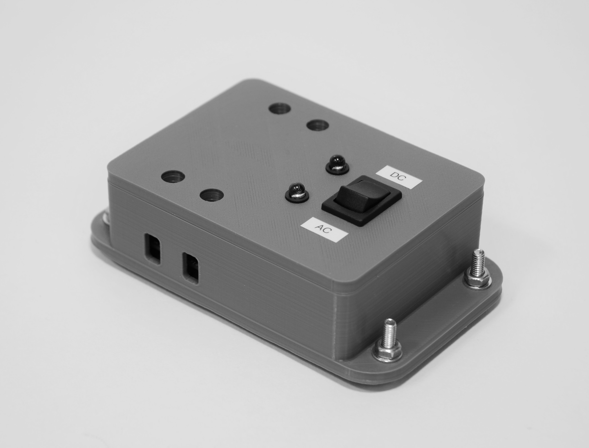

# SmartSwitch
Easy home IoT. Splice between home wiring (120-240V AC/7-32V DC) to control anything downstream from the web.

 

 
  

 

The ESP8266 microcontroller is utilized as a webserver. When an HTTP request is received, the relay state is set accordingly and an HTML form is sent to the user's browser. HTML forms are stored on the ESP8266's SPI flash.

 

 
  

 
